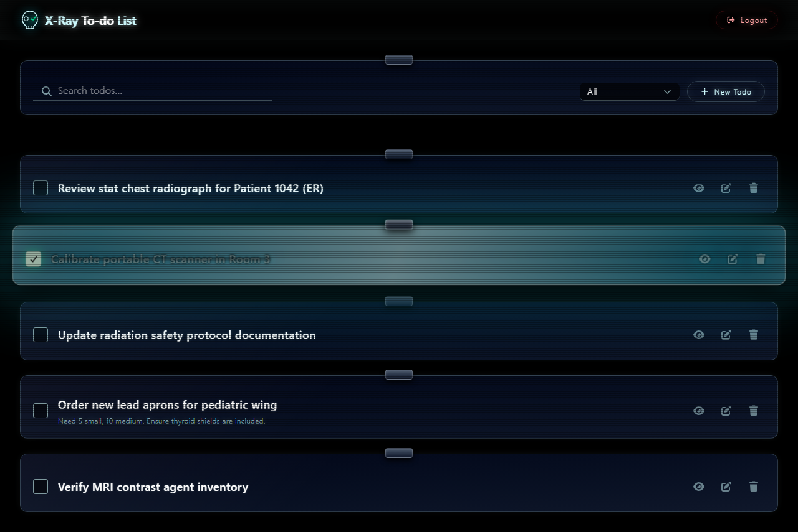

# X-Ray To-do List
A simple to-do list app that explores using React on the frontend and .NET on the backend with production-minded capabilities like filtering and simple fuzzy search.

## Frontend

See [Frontend README](frontend/README.md) for instructions on running the frontend and the design choices made there.

## Backend

See [Backend README](backend/README.md) for instructions on running the backend and the design choices made there.

## 🚀 Usage Guide

Once the application is running (see component READMEs for setup), open your browser and navigate to `http://localhost:5173`.

1. **Register**: Click the "Register" link on the login page to create a new, isolated user account. All your tasks will be securely tied only to you.
2. **Login**: Use the credentials you just created to authenticate.
3. **Dashboard**: After logging in, you'll see your main X-Ray dashboard.
4. **Create**: Use the "New Todo" input at the top to quickly add items to your list.
5. **Manage**: Click the glowing checkbox to toggle a task's status, or use the "Edit" button to change its name.
6. **Search**: Use the search bar to instantly filter your tasks. The search is debounced, so you can type naturally.
7. **Details**: Click the "Details" button on any task to view expanded information, including creation dates and a longer description if you added one.
8. **Delete**: Remove any to-dos that you are not happy with!
9. **Logout**: Click the "Logout" button to log out.

## Assumptions

- Users want a fast, desktop-like experience, expecting UI updates without page reloads.
- The system uses SQLite to prioritize zero-configuration local development over out-of-the-box cluster support.
- Authentication relies on secure cookie storage (`HttpOnly`, `SameSite=Strict`), assuming modern browser usage.
- Data is entirely isolated per user and there is no need for sharing or collaboration features in this version.

## Scalability

- **Database Swappability**: Switching from SQLite to a robust RDBMS (like PostgreSQL or SQL Server) only requires changing a single line in the backend's `Program.cs` and updating the connection string, courtesy of Entity Framework Core.
- **Frontend Edge Deployment**: The Vite/React application compiles to static assets, allowing it to be deployed to a CDN (e.g., Vercel, Netlify) for near-infinite, low-latency global scalability.
- **Stateless Backend Auth**: ASP.NET Core Identity issues DPAPI-encrypted cookies containing the user's claims, keeping the backend APIs stateless. To scale the backend horizontally (web farm), the Data Protection Keys simply need to be centralized (e.g., Redis or Azure Key Vault) so all nodes can decrypt the same session cookies.

## Future Improvements

While the application is fully functional, here are areas identified for potential future enhancement:

- **Enhanced Error Handling**: Implement more robust, user-friendly frontend feedback mechanisms (e.g., global toast notifications for transient API failures). Better handling of API errors in general.
- **Production Hosting**: Deploy the application to a live environment (e.g., Azure App Service for the backend, Vercel for the frontend).
- **Containerization**: Add comprehensive Docker support (`Dockerfile` & `docker-compose.yml`) for consistent, self-contained deployment and local environment parity.
- **Pagination / Infinite Scroll**: As the dataset grows, implement backend pagination and frontend infinite scrolling for the Todo list to maintain performance.